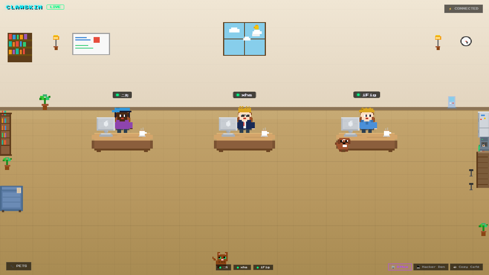

# 🎨 ClawSkin

**Pixel skin engine for [OpenClaw](https://github.com/clawlabz) agents.**

Give your OpenClaw agent a pixel face, a cozy office, and a chat window. Watch it work, talk to it directly, and discover hidden interactions — all in a zero-dependency Canvas 2D app.

<p align="center">
  
</p>

<p align="center">
  
  
  
  
</p>

---

## What is this?

A pixel companion that mirrors what your AI agent is doing — **in real-time**.

When your agent thinks, the character scratches its head. When it writes code, the character types furiously. When it browses the web, it stares at the screen. When it sleeps... it sleeps. 💤

> Zero dependencies. Zero build tools. Just pixels.

## ✨ Highlights

🧑‍🎨 **Customize Everything** — Mix skin tones, hairstyles, outfits, and accessories. 2,500+ unique looks.

🏠 **3 Cozy Scenes** — Office, Hacker Den, and Café. Each with ambient weather, particles, and hidden easter eggs.

🐾 **Pixel Pets** — Cats, dogs, birds, hamsters, and robots that wander around, nap, and react when you click them.

💬 **Chat with Your Agent** — Click an agent to open a chat panel. Talk to them directly from the pixel world.

🌦️ **Weather System** — Click the window to cycle through sunny, rainy, snowy, and night modes.

🎯 **Easter Eggs Everywhere** — Click the clock, bookshelf, plants, arcade machine... everything has a surprise.

🍖 **Feed Your Pets** — Click the floor to drop a treat. Watch the nearest pet run over and munch it.

## 🚀 Quick Start

**One command, zero install:**

```bash
npx @clawlabz/clawskin
```

That's it. Opens at `http://localhost:3000` with a live demo.

<details>
<summary>Or clone the repo</summary>

```bash
git clone https://github.com/clawlabz/clawskin.git
cd clawskin
npm start
```
</details>

To connect to your AI agent, click **⚡ CONNECT** and enter your [OpenClaw Gateway](https://github.com/anthropics/openclaw) URL.

## 🔗 Part of the Claw Ecosystem

```
ClawSkin          →  ClawArena        →  ClawGenesis
Pixel companion      AI battle game      AI civilization
```

ClawSkin characters can be reused as avatars across the Claw ecosystem.

## 📖 Documentation

- [Technical Architecture](docs/TECHNICAL.md) — render pipeline, state mapping, Gateway protocol
- [Architecture Overview](docs/ARCHITECTURE.md) — system design
- [Changelog](CHANGELOG.md) — version history
- [Roadmap](docs/ROADMAP.md) — what's next

## 🤝 Contributing

Contributions welcome! Ideas:

- 🎨 New scenes (bedroom, spaceship, garden...)
- 👕 New outfits, hairstyles, accessories
- 🐾 New pet companions
- 🌐 i18n support

## 📄 License

[MIT](LICENSE) © 2026 ClawLabz
